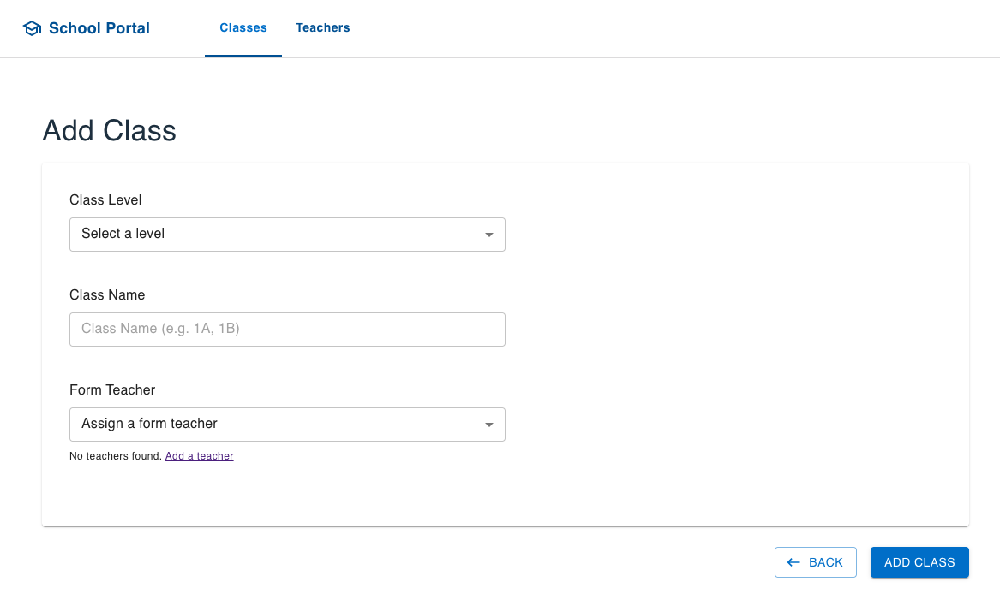

# Teachers Management System 

## User Flow + API

**GET: `api/teachers`**
> Assumption: Route `/` redirects to `api/teachers` to get all teachers.
> If no teacher available, screenshot below is shown.


**POST: `api/teachers`**
> Assumption: Contact Number is limited to 8-digits, for +65 numbers only.
> 

**GET: `api/classes`**
> Assumption: Route `/` redirects to `api/classes` to get all classes.
> If no class available, screenshot below is shown.


**POST: `api/classes`**
> Assumption: Class Name expects 8-digits (e.g.: Class 1A) payload. If no teacher is available, a link to add teacher is shown.
> 



## Run the project

### 1. Clone the repository

```
git clone https://github.com/vivienphang/teachers-management.git
cd teachers-management
```

### 2. Setup the backend
```
cd backend
npm install
```

**Configure PostgreSQL**
   - Create a `.env` file based on snippet below
   - Set your database credentials accordingly
```
# Backend .env file
PG_USER=your_db_username
PG_PASSWORD=your_db_password
PG_DATABASE=teachers_management_db
PG_HOST=localhost
PG_PORT=5432
PORT=8000
FRONTEND_URL=http://localhost:5173
```

**Run Migrations**
```
npx sequelize-cli db:migrate
```
**Start the backend server**
```
npm run dev
```
The backend will run on http://localhost:8000 as per `.env`.

### 3. Setup the frontend
> Assuming you are in `teachers-management/backend` directory:
```
cd ../frontend
npm install
```
Create a `.env` file based on snippet below
```
# Frontend .env file
VITE_BACKEND_URL=http://localhost:8000
```

**Configure CORS**

Ensure that the backend (http://localhost:8000) is configured to allow requests from the frontend via CORS and accessible from the frontend.
> If needed, verify the `cors` middleware setup in the backend (`backend/server.ts`) allows the frontend origin.

**Start the Frontend**
```
npm run dev
```
The frontend will run on http://localhost:5173 

## Tech Stack
**Backend:** Node.js, Express.js, PostgreSQL, Sequelize ORM

**Frontend:** React with Vite, Material UI (MUI)

## Development Process
1. Designed the database schema and defined the relationships between tables.
2. Setup Sequelize models and ran migrations.
3. Built the backend API endpoints and tested using Postman.
4. Developed the frontend architecture: Components, pages, layouts, routes.
5. Setup CORS on the backend to allow access from frontend.
6. Implemented basic error handlings for smoother user flow.
7. Documented setup instructions in `README.md` for reviewers.

## Future Improvements & Considerations
1. Unit Testing: Add unit and integration tests using Jest and React Testing Library to ensure component and API reliability.
2. Mobile Responsiveness: Enhance layout across various screen sizes (mobile, tablet, desktop) for seamless user experience.
